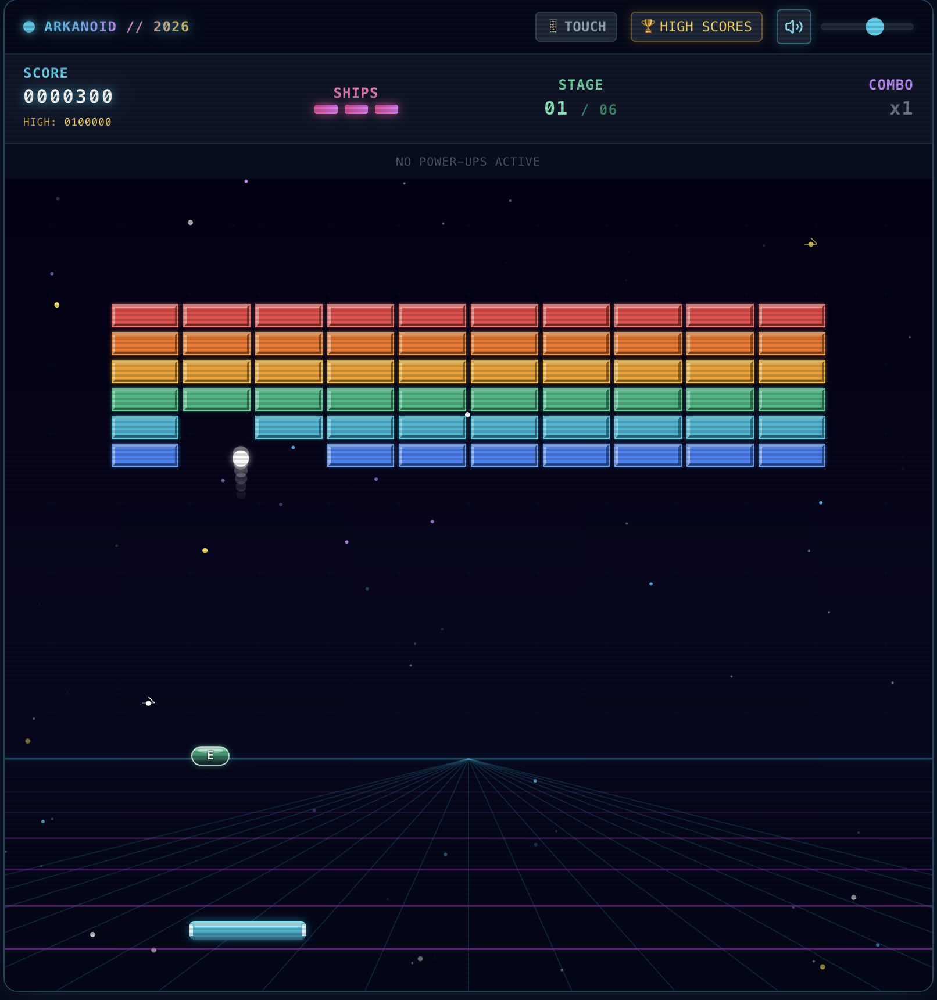

# 🕹️ Arkanoid Retro Arcade

A high-performance, neon-themed Arkanoid / Brick Breaker web application built with **Next.js**, **React**, **HTML5 Canvas 2D**, **Web Audio API**, and **Tailwind CSS**.



---

## ✨ Features

- **60 FPS Deterministic Physics Engine**: Fixed-timestep accumulator loop (`fixedDt = 1/60s`) with sub-stepping circle-to-AABB continuous collision detection.
- **Decoupled State Bridge**: Zero React reconciliation overhead on animation frames while synchronizing HUD, modals, and achievements seamlessly.
- **7 Collectible Power-ups**:
  - 💥 **Multi-Ball**: Triple split projectiles.
  - 🔫 **Laser Paddle**: Dual blasters destroying bricks on impact.
  - ↔️ **Extend / Shrink Paddle**: Dynamic width modulation.
  - ⚡ **Slow / Fast Ball**: Velocity scaling.
  - 🧲 **Sticky / Catch Paddle**: Hold and manual launch.
  - 🛡️ **Shield Barrier**: Bottom safety floor bouncing lost balls.
- **Multi-Tier Bricks**: Standard, Armored (multi-hit), Indestructible, and Explosive TNT cascade bricks.
- **Procedural 8-bit Web Audio Synth**: Zero-dependency Web Audio API sound effects with pitch scaling for combos.
- **Visual FX & Retro Polish**: CRT scanline overlay toggle, neon bloom, particle bursts, and quadratic trauma screen shake.
- **Responsive Controls**: Full keyboard, mouse, and mobile touch gesture support.
- **Persistent High Scores**: SSR-safe LocalStorage scoreboard with initials and stats.

---

## 🎮 Controls

| Action | Keyboard | Mouse / Touch |
|---|---|---|
| **Move Paddle** | `Left` / `Right` Arrow keys, `A` / `D` | Mouse move / Touch drag |
| **Launch Ball** | `Spacebar` | Tap / Left Click |
| **Fire Lasers** | `Spacebar` / `Up` Arrow / `W` | Tap / Left Click |
| **Pause Game** | `P` / `Escape` | Pause HUD button |

---

## 🚀 Getting Started

### Prerequisites
- Node.js 18.x or later
- npm or yarn / pnpm

### Installation

```bash
# Clone the repository
git clone git@github.com:sd-dweb/arkanoid.git
cd arkanoid

# Install dependencies
npm install

# Run the development server
npm run dev
```

Open [http://localhost:3000](http://localhost:3000) in your browser.

---

## 🛠️ Tech Stack

- **Framework**: [Next.js 14](https://nextjs.org/) (App Router)
- **UI & State**: [React 18](https://react.dev/), [Tailwind CSS](https://tailwindcss.com/), [Lucide React](https://lucide.dev/)
- **Engine & Graphics**: HTML5 Canvas 2D Context
- **Sound**: Web Audio API (Procedural Synthesizer)
- **Testing**: [Vitest](https://vitest.dev/), [React Testing Library](https://testing-library.com/), `vitest-canvas-mock`

---

## 🧪 Testing

```bash
# Run test suite
npm test

# Run tests with coverage
npm run test:coverage
```

---

## 📄 License

MIT License. Feel free to modify and use!
